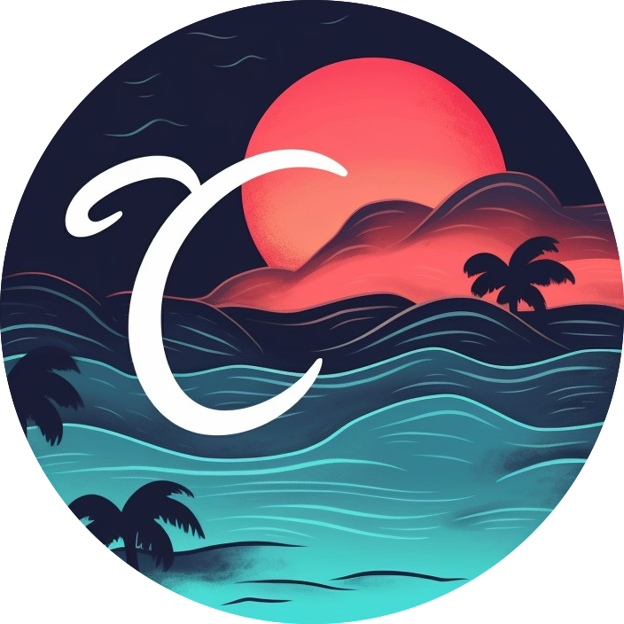

# 𝒞irc

Chic browser designed for minimalists, originally designed to be a nicer Safari  
I didn't realize Safari [updated its UI [Preferences > Tabs > Compact] ](https://www.youtube.com/watch?v=0TD96VTf0Xs&t=5267s) until later

### Features

- Adaptive size vertical tabs
- Console style search bar
- Swipe gestures on tab bar
  - Show currently open profiles [Swipe up]
  - Close tab [Swipe down]
  - Switch to another profile [Swipe left-right] 
- Swipe left-right on page to go back-forward 
- Built in ad blocker
- Reader view with theming
- Profiles [tab groups]
- Adaptive page colour tab bar
 

https://github.com/qqap/circ/assets/116848054/373a5323-37ed-4e69-b53e-ac28f7666c88

Fork of [Min](https://github.com/minbrowser/min)

